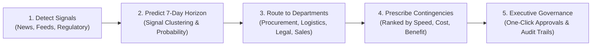

# BusinessPulse AI

> **Proactive Enterprise Resilience & Predictive Risk Intelligence Platform**  
> *Connecting External Signals to Internal Business Exposure Before Operations Are Impacted.*

[](https://www.exasol.com)
[](https://fastapi.tiangolo.com)
[](https://ai.google.dev)
[](#)

---

## 💡 The Paradigm Shift

Most enterprise risk dashboards are **reactive**:
> *"A disruption happened; here is the damage report."*

**BusinessPulse AI** is **proactive and predictive**:
> *"Early leading indicators suggest a high-probability supply chain disruption within 7 days; prepare the right departments, activate contingency strategies, and protect high-margin revenue before assembly lines are affected."*

Built for the **Exasol DevJam Hackathon**, BusinessPulse AI uses a synthetic **Tesla Inc.** exposure profile (semiconductor suppliers, battery cell partners, Model Y/3 vehicle lines, regional tariffs, competitor dynamics) to showcase how **Exasol's high-speed in-memory analytics** combined with **Gemini AI** can deliver real-time resilience intelligence to executive leadership.

---

## 🌟 Core Pillars & Capabilities



### 1. 🚨 Predictive 7-Day Early-Warning Radar
- **Signal Clustering Engine**: Detects patterns across disparate signals (e.g. Typhoon warning + Kaohsiung port congestion + MCU lead time spikes).
- **Explainable Disruption Probability**: Estimates a 7-day risk probability (e.g., **96.0% probability of supply-chain disruption within 7 days**) based on signal frequency, severity, and internal supplier dependency scores.
- **Proactive Readiness Directives**: Prescribes immediate buffer audits and volume locking before operational bottlenecks occur.

### 2. 🏢 Department Action Routing Hub
- **Automated Enterprise Task Routing**:
  - **Procurement & Supply Chain** (*VP of Global Procurement*): Audits 14-day stock buffers, locks volume allocations, and engages secondary vendors.
  - **Logistics & Transportation** (*Director of Global Freight Logistics*): Evaluates alternative shipping lanes and prepares express air-freight routing.
  - **Legal & Regulatory Affairs** (*Director of Regulatory Compliance*): Assesses domestic battery content origin thresholds for EV tax credit compliance.
  - **Commercial Sales & Pricing** (*Head of Pricing & Product Strategy*): Models customer demand elasticity and prepares promotional lease/financing packages.
  - **Finance & FP&A** (*VP of FP&A*): Updates quarterly revenue risk forecasts and margin sensitivity models.
- **SLA & Escalation Governance**: Each task includes a target resolution due date and defined escalation paths (*e.g., "Escalate to COO if shipment confirmation is unverified within 24h"*).

### 3. 🛠️ Contingency Recommendation Matrix
- Evaluates threats and generates **ranked feasibility options** with clear operational trade-offs:
  - **Speed**: `Immediate`, `Fast`, `Medium`
  - **Cost**: `Low`, `Medium`, `High`
  - **Business Benefit**: (e.g. *"Protects higher-margin Model Y vehicle revenue during component constraints."*)
- **Human Authorization Workflow**: Labeled as actionable recommendations requiring manager approval via one-click `Approve Strategy` buttons.

### 4. ⚡ In-Memory Exasol Analytical Data Model
- High-concurrency schema defined in [`sql/exasol_schema.sql`](sql/exasol_schema.sql) supporting real-time analytical joins between incoming news clusters and internal enterprise exposure matrices:
  - `TESLA_EXPOSURE`: Internal BOM dependencies, inventory coverage, and revenue weights.
  - `NEWS_EVENTS`: Ingested and normalized external signals.
  - `EVENT_EXPOSURE_MAP`: Relational join mapping events to internal operational dependencies.
  - `RISK_SCORES`: Computed 5-factor priority scores and dollar revenue exposure.
  - `EARLY_WARNINGS`: Clustered predictive disruption warnings.
  - `MITIGATION_TASKS`: Departmental task assignments, SLAs, and escalation paths.
  - `CONTINGENCY_OPTIONS`: Ranked contingency alternatives and approval status.

### 5. 🧮 Explainable 5-Factor Risk & Revenue Exposure Model
$$\text{Priority Score} = 0.25 \times \text{Severity} + 0.35 \times \text{Dependency} + 0.20 \times \text{Urgency} + 0.10 \times \text{Likelihood} + 0.10 \times \text{Confidence}$$

$$\text{Estimated Revenue at Risk (USD)} = \frac{\text{Revenue Weight}}{100} \times \$250,000,000 \times \frac{\text{Priority Score}}{100}$$

---

## 🎬 Multi-Signal Demo Storyline

Clicking **"⚡ Run Multi-Signal Demo"** simulates a realistic 5-signal crisis scenario:

1. **Signal 1 (Meteorological)**: Typhoon warning issued for northern Taiwan semiconductor fabrication corridor.
2. **Signal 2 (Logistics)**: Taiwanese ports in Kaohsiung & Keelung report container delays and vessel bottlenecks.
3. **Signal 3 (Component Market)**: Automotive microcontroller delivery lead times surge following facility downtime.
4. **Signal 4 (Regulatory Policy)**: U.S. federal proposal introduces stricter battery component origin rules for EV tax credits.
5. **Signal 5 (Competitor Pricing)**: BYD announces aggressive 7–11% price cuts on premium electric models in China.

**The Result**:
- Signals 1–3 cluster into a **96.0% 7-Day Early Warning** on `Taiwan Chip Partner` affecting Model 3 & Model Y production.
- **8 Cross-Department Tasks** are routed immediately to Procurement, Logistics, Legal, and Sales.
- **16 Ranked Contingency Strategies** are generated with immediate mitigation options.

---

## 🚀 Quickstart & Local Installation

### Prerequisites
- Python 3.10+
- (Optional) [Google Gemini API Key](https://aistudio.google.com/) for live LLM extraction. *The app includes a deterministic fallback engine and runs 100% offline out-of-the-box.*

### 1. Clone & Set Up Environment
```powershell
git clone https://github.com/sureshkumark2505/businesspulse-ai.git
cd businesspulse-ai

python -m venv .venv
.\.venv\Scripts\Activate.ps1
pip install -r requirements.txt
```

### 2. Configure Environment Variables
Copy `.env.example` to `.env`:
```powershell
Copy-Item .env.example .env
```
*(Optional: Set your `GEMINI_API_KEY` in `.env` for live LLM extraction).*

### 3. Start the Application
```powershell
uvicorn app:app --reload
```

### 4. Open the Executive Dashboard
Open your browser at:
👉 **[http://127.0.0.1:8000](http://127.0.0.1:8000)**

Click **"⚡ Run Multi-Signal Demo"** to initialize the intelligence pipeline and explore the dashboard!

---

## 🗄️ Exasol Production Deployment

To run against a live **Exasol** database cluster:

1. **Run the DDL Script**:
   Execute [`sql/exasol_schema.sql`](sql/exasol_schema.sql) in your Exasol SQL client (e.g., DBeaver or Exasol DB client).

2. **Update `.env`**:
   ```ini
   DATABASE_BACKEND=exasol
   EXASOL_DSN=your-exasol-host:8563
   EXASOL_USER=your_exasol_username
   EXASOL_PASSWORD=your_exasol_password
   EXASOL_SCHEMA=BUSINESSPULSE
   ```

*(Exasol Personal can be run locally for free using Docker: `docker run -d -p 8563:8563 exasol/docker-db:latest`)*

---

## 📡 REST API Reference

| Method | Endpoint | Description |
| :--- | :--- | :--- |
| `GET` | `/` | Serves the interactive executive web dashboard. |
| `GET` | `/health` | System health check and database engine status. |
| `GET` | `/api/dashboard` | Returns early warnings, threat events, department tasks, contingencies, and metrics. |
| `GET` | `/api/briefing` | Generates a synthesized executive daily rollup with proactive 7-day outlook. |
| `POST` | `/api/events/analyze` | Ingests and processes a news article (`title`, `content`, `source_name`, `source_url`). |
| `POST` | `/api/tasks/{id}/status` | Updates mitigation task status (`Assigned`, `In Progress`, `Contingency Activated`, `Resolved`). |
| `POST` | `/api/contingencies/{id}/approve` | Approves a ranked contingency recommendation. |
| `POST` | `/api/demo/reset` | Resets the database and seeds the multi-signal demo sequence. |

---

## 📁 Repository Structure

```
businesspulse-ai/
├── app.py                     # FastAPI service, early warning engine, action router, and API endpoints
├── requirements.txt           # Python dependencies (FastAPI, Uvicorn, Requests, PyExasol, python-dotenv)
├── .env.example               # Configuration template
├── .gitignore                 # Git ignore rules
├── README.md                  # Project documentation & hackathon guide
├── sql/
│   └── exasol_schema.sql      # Production DDL schema for Exasol analytics database
├── static/
│   └── index.html             # Responsive executive dashboard UI
└── outputs/
    ├── BusinessPulse_AI_PRD.docx      # 14-section Product Requirements Document (PRD)
    └── BusinessPulse_AI_Tesla_MVP.zip  # Packaged deliverable bundle
```

---

## 🏆 Exasol DevJam Deliverables

- **Official PRD Document**: [`outputs/BusinessPulse_AI_PRD.docx`](outputs/BusinessPulse_AI_PRD.docx) (Complete 14-section architectural design).
- **Target Platform**: Exasol Analytics Database & Personal Edition.
- **Hackathon Track**: AI & Data-Powered Solutions / Enterprise Early Warning Intelligence.
